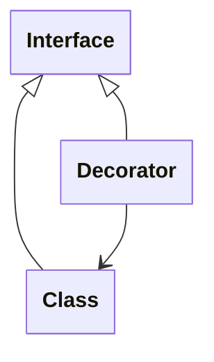
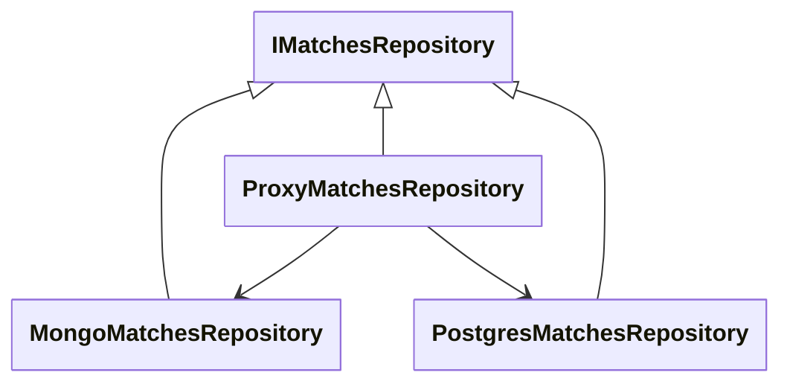

# Tutorial - Step 3

In this step the goal is to create a `ProxyMatchesRepository` which forwards
all of the read calls to the Mongo repository and can safely write data to
_both_ the Mongo and Postgres repositories.


## The _Decorator_ Pattern

A decorator uses an abstraction to wrap additional functionality around some existing code
without making changes to that code (an application of the Open-Closed principle.)

The typical pattern looks something like this:



Both the class being decorated and the decorator implement the same interface,
and the decorator is also given an instance of the interface.
Composition of the implementation typically happens in dependency injection config.

This pattern can be used in various useful ways, like adding logging or caching
to some existing code.
In our case, our decorator will receive _two_ implementations:



## The _Proxy_ Pattern

A proxy is a placeholder or substitute for another object.
In our case, our code will act as proxy between the two database implementations.
We'll use feature flags to control which databases are in use.


## The _Parallel Run_ Pattern

This pattern involves running a legacy process in parallel with a new process.
We will invoke this as we write data to the old database (Mongo)
along with the new database (Postgres).

When invoking this pattern with database writes, it is sometimes called _dual writes._


## Create the Decorator Proxy

We can initially scaffold the proxy by forwarding everything to the Mongo repository:

```csharp
public class ProxyMatchesRepository(
    MongoMatchesRepository mongo,
    PostgresMatchesRepository postgres,
    IFeatureFlagRepository featureFlagRepository,
    ILogger<ProxyMatchesRepository> logger) : IMatchesRepository
{
    public async Task InsertMatchAsync(Match match)
    {
        await mongo.InsertMatchAsync(match);
    }

    public async Task<long> LoadWinCountForPlayerAsync(Guid playerId, DateTimeOffset? from, DateTimeOffset? to)
    {
        return await mongo.LoadWinCountForPlayerAsync(playerId, from, to);
    }

    // ... any other necessary methods ...
}
```

At this point we can configure our dependency injection in the Api's `Program.cs`
by removing this line from [step 1](./tutorial-step-01.md):

```csharp
builder.Services.AddSingleton<IMatchesRepository, MongoMatchesRepository>();
```

Replace it with this:
```csharp
builder.Services.AddSingleton<IMatchesRepository>(x => new ProxyMatchesRepository(
    new MongoMatchesRepository(x.GetRequiredService<IMongoDatabase>()),
    new PostgresMatchesRepository(x.GetRequiredService<IPostgres>()),
    x.GetRequiredService<IFeatureFlagRepository>(),
    x.GetRequiredService<ILogger<ProxyMatchesRepository>>()
));
```

> **Warning:** Make sure that you put the constructor parameters for the proxy in the right order.
> Otherwise you may accidentally start writing all your data to Postgres!

At this point, you should be able to safely deploy the code, even if your PostgresMatchesRepository
throws exceptions for every method, because we're not touching that repository yet.


## Gate Postgres Writes

Next we will update the our insert (write) method so when a `write-matches-to-postgres`
feature flag is enabled, we will try to also write the match to postgres and log any exceptions.

```csharp
    private static readonly TimeSpan PostgresTimeout = TimeSpan.FromSeconds(2);

    public async Task InsertMatchAsync(Match match)
    {
        await mongo.InsertMatchAsync(match);

        if (await featureFlagRepository.IsEnabledAsync("write-matches-to-postgres"))
        {
            try {
                await postgres.InsertMatchAsync(match).WaitAsync(PostgresTimeout);
            }
            catch (Exception e)
            {
                logger.LogWarning(e, "Error writing to postgres");
            }
        }
    }
```

The `try..catch` will ensure that no exceptions cause problems for our Api clients.
The `.WaitAsync(PostgresTimeout);` mitigates any long delays that might come up.


## Try It Out!

We can now run an experiment to see if our postgres write is working correctly,
and dynamically turn the feature flag on and off.

If you haven't already been running the Api and simulated traffic, open two separate terminals.
In the first, run:

```bash
docker compose up -d

cd RockPaperScissors.DataTools
dotnet run simulate-traffic
```

And in the other:

```bash
cd RockPaperScissors.Api
dotnet run
```

You should see successful calls to the API.
The feature flag is off by default, so no attempts will be made to write to Postgres.
We can turn that on (in yet another terminal window) by running:

```bash
cd RockPaperScissors.DataTools
dotnet run enable-flag write-matches-to-postgres
```

The simulated traffic should continue on without any problem or interruption.
But if any of the writes to Postgres fail, you should see warnings in the Api's logs.

If there are problems, you can turn the feature flag off with:

```bash
dotnet run disable-flag write-matches-to-postgres
```

If there are no write errors logged, we can look in Postgres to see if we're writing to the table:

```bash
docker exec rps-postgres psql -U rps -d rockpaperscissors -c "SELECT * FROM matches ORDER BY recorded_at DESC LIMIT 10;"
```


## Intentionally Bad Code

If you didn't run into any errors or just want to verify that the proxy repository really is safe,
you can add some code to intentionally trigger problems.

In the `PostgresMatchesRepository.InsertMatchAsync` try adding one or both of the following:
* `await Task.Delay(30000);`
* `throw new NotImplementedException();`

You should see errors in the console, but the simulated traffic will continue on with minimal slowing.


## Next Step

[Shadow read from Postgres and log differences](./tutorial-step-04.md).
